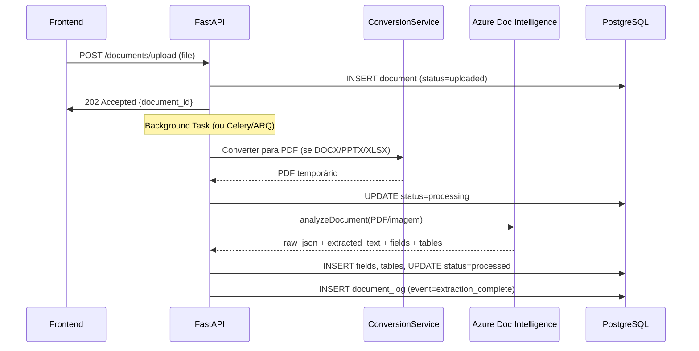
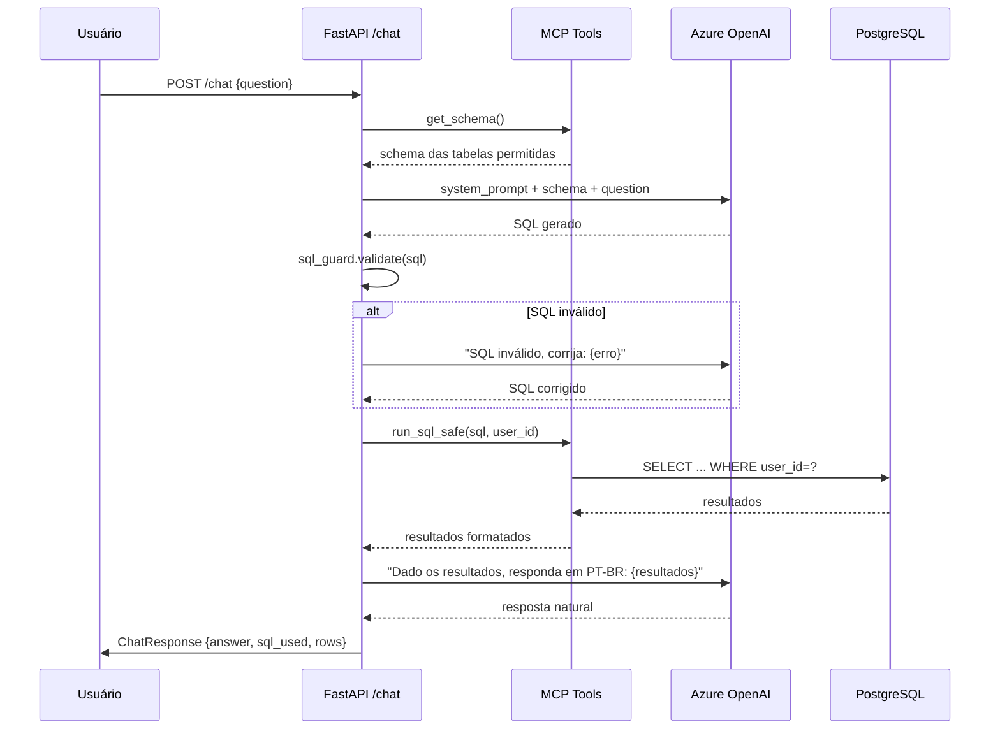

# 🏗️ Arquitetura Backend — SmartDocs (FastAPI)

Plano de arquitetura, bibliotecas e estrutura de projeto para o backend do SmartDocs.

---

## Stack de Bibliotecas Recomendada

### Core

| Lib | Versão | Motivo |
|-----|--------|--------|
| `fastapi` | ≥0.115 | Framework async, docs automáticas (OpenAPI), type-safe |
| `uvicorn[standard]` | ≥0.34 | ASGI server com `uvloop` para performance |
| `pydantic` | ≥2.10 | Validação de dados, schemas request/response |
| `pydantic-settings` | ≥2.7 | Carregar variáveis de ambiente / `.env` |

### Banco de Dados (Async)

| Lib | Versão | Motivo |
|-----|--------|--------|
| `sqlalchemy[asyncio]` | ≥2.0 | ORM async, `AsyncSession`, `create_async_engine` |
| `asyncpg` | ≥0.30 | Driver PostgreSQL async mais rápido para Python |
| `alembic` | ≥1.14 | Migrations de schema — padrão da indústria com SQLAlchemy |

> [!TIP]
> **Por que `asyncpg` e não `psycopg3`?** `asyncpg` é ~3x mais rápido em benchmarks de throughput e é o driver mais usado em produção com FastAPI + SQLAlchemy async.

### Autenticação

| Lib | Versão | Motivo |
|-----|--------|--------|
| `PyJWT[cryptography]` | ≥2.10 | JWT encode/decode — API simples, suporte a RS256/ES256 |
| `pwdlib[argon2]` | ≥0.2 | Hash de senhas com Argon2 — recomendação atual do FastAPI (substitui `passlib`) |

> [!IMPORTANT]
> **`passlib` está deprecated.** A recomendação oficial do FastAPI agora é `pwdlib` com Argon2. Argon2 é resistente a ataques GPU, superior ao bcrypt.

### Azure SDKs

| Lib | Versão | Motivo |
|-----|--------|--------|
| `azure-ai-documentintelligence` | ≥1.0.2 | SDK oficial para Document Intelligence (API 2024-11-30) |
| `openai` | ≥1.60 | SDK oficial OpenAI — compatível com Azure OpenAI via `AzureOpenAI` client |
| `azure-identity` | ≥1.19 | Autenticação com Azure (DefaultAzureCredential) |
| `azure-storage-blob` | ≥12.24 | Upload de arquivos para Azure Blob Storage |

> [!NOTE]
> O SDK `openai` oficial já suporta Azure OpenAI nativamente via `AzureOpenAI(api_version=..., azure_endpoint=...)`, sem precisar do antigo `azure-openai`.

### Conversão de Documentos

| Lib | Motivo |
|-----|--------|
| **LibreOffice headless** (via `subprocess`) | DOCX/PPTX/XLSX → PDF — open-source, cross-platform |
| `openpyxl` ≥3.1 | Extração nativa de XLSX (tabelas já estruturadas) — Caminho B futuro |
| `python-docx` ≥1.1 | Extração de texto DOCX (fallback se DI falhar) |
| `Pillow` ≥11.0 | Processamento de imagens (resize, format conversion antes do DI) |

> [!WARNING]
> **LibreOffice headless** precisa estar instalado no container Docker. No `Dockerfile`, adicione: `RUN apt-get install -y libreoffice-writer libreoffice-calc libreoffice-impress`. No MVP, converta **tudo** para PDF antes de enviar ao Azure DI.

### MCP (Model Context Protocol)

| Lib | Motivo |
|-----|--------|
| `mcp[cli]` ≥1.0 | SDK oficial do MCP — cria tools como `get_schema()`, `run_sql_safe()` |
| `fastapi-mcp` | Expõe endpoints FastAPI como MCP tools automaticamente |

### Utilitários

| Lib | Motivo |
|-----|--------|
| `httpx` | HTTP client async (chamadas internas, testes) |
| `python-multipart` | Suporte a upload de arquivos no FastAPI |
| `loguru` | Logging estruturado e elegante |
| `orjson` | JSON serialization 10x mais rápida (integra com FastAPI `ORJSONResponse`) |

---

## Estrutura de Pastas do Backend

```
backend/
├── alembic/                      # Migrations
│   ├── versions/
│   └── env.py
├── app/
│   ├── __init__.py
│   ├── main.py                   # FastAPI app factory
│   ├── config.py                 # pydantic-settings (Settings class)
│   ├── database.py               # AsyncEngine, AsyncSession, get_db
│   │
│   ├── models/                   # SQLAlchemy models (ORM)
│   │   ├── __init__.py
│   │   ├── user.py               # User model
│   │   ├── document.py           # Document + DocumentField + DocumentTable
│   │   ├── contract.py           # Entidades normalizadas
│   │   └── document_log.py       # Logs
│   │
│   ├── schemas/                  # Pydantic schemas (request/response)
│   │   ├── __init__.py
│   │   ├── auth.py               # LoginRequest, TokenResponse, UserCreate
│   │   ├── document.py           # DocumentUploadResponse, DocumentDetail
│   │   └── chat.py               # ChatRequest, ChatResponse
│   │
│   ├── api/                      # FastAPI routers
│   │   ├── __init__.py
│   │   ├── auth.py               # /auth/register, /auth/login
│   │   ├── documents.py          # /documents/upload, /documents/{id}
│   │   ├── chat.py               # /chat
│   │   └── admin.py              # /admin/users (CRUD para admin)
│   │
│   ├── services/                 # Business logic
│   │   ├── __init__.py
│   │   ├── auth_service.py       # hash de senha, criar JWT, validar
│   │   ├── document_service.py   # upload, conversão, extração, salvar
│   │   ├── extraction_service.py # Azure Document Intelligence
│   │   ├── conversion_service.py # DOCX→PDF, PPTX→PDF via LibreOffice
│   │   ├── chat_service.py       # NL→SQL→Response pipeline
│   │   └── sql_guard.py          # Validação de SQL (só SELECT, LIMIT, user_id filter)
│   │
│   ├── mcp/                      # MCP Tools
│   │   ├── __init__.py
│   │   ├── server.py             # MCP server setup
│   │   └── tools.py              # get_schema, run_sql_safe, get_document_summary
│   │
│   ├── core/                     # Cross-cutting
│   │   ├── __init__.py
│   │   ├── security.py           # JWT utils, OAuth2PasswordBearer, get_current_user
│   │   ├── exceptions.py         # Custom exceptions + handlers
│   │   └── deps.py               # Shared dependencies (get_db, require_admin, etc.)
│   │
│   └── utils/                    # Helpers
│       ├── __init__.py
│       └── file_utils.py         # Extensão, MIME type, temp files
│
├── tests/                        # Pytest
│   ├── conftest.py
│   ├── test_auth.py
│   ├── test_documents.py
│   └── test_chat.py
│
├── Dockerfile
├── docker-compose.yml            # Local dev: PostgreSQL + app
├── requirements.txt              # ou pyproject.toml
├── alembic.ini
└── .env.example
```

---

## Fluxo de Upload (Detalhado)



---

## Fluxo do Chat SQL



---

## Decisões de Arquitetura

### 1. Processamento assíncrono de uploads
- **MVP**: `BackgroundTasks` do FastAPI (simples, zero infra extra)
- **Produção**: migrar para **ARQ** (task queue async com Redis) ou **Celery**
- O endpoint retorna `202 Accepted` imediatamente; o frontend faz polling via `GET /documents/{id}` ou usa WebSocket

### 2. Storage de arquivos
- **MVP**: salvar no filesystem local (`/tmp/uploads/`)
- **Produção**: **Azure Blob Storage** — o arquivo original fica no blob, e só o `blob_url` é salvo no banco

### 3. SQL Guardrails (Obrigatório)
O `sql_guard.py` deve:
- Rejeitar qualquer coisa que não seja `SELECT`
- Adicionar `LIMIT 100` se ausente
- Injetar `WHERE documents.user_id = :user_id` para usuários comuns
- Admin pode ver tudo (bypass do filtro de user_id)
- Usar regex + AST parsing (via `sqlparse`) para validação robusta

### 4. MCP vs Function Calling direto
- **Recomendação**: começar com **function calling direto** do Azure OpenAI (mais simples)
- Migrar para **MCP completo** quando quiser que o modelo tenha mais autonomia com múltiplas tools

---

## `requirements.txt` (MVP)

```
# Core
fastapi>=0.115
uvicorn[standard]>=0.34
pydantic>=2.10
pydantic-settings>=2.7

# Database
sqlalchemy[asyncio]>=2.0
asyncpg>=0.30
alembic>=1.14

# Auth
PyJWT[cryptography]>=2.10
pwdlib[argon2]>=0.2

# Azure
azure-ai-documentintelligence>=1.0.2
openai>=1.60
azure-identity>=1.19
azure-storage-blob>=12.24

# Document conversion
openpyxl>=3.1
python-docx>=1.1
Pillow>=11.0

# Utilities
httpx>=0.28
python-multipart>=0.0.18
loguru>=0.7
orjson>=3.10
sqlparse>=0.5

# Testing
pytest>=8.3
pytest-asyncio>=0.24
httpx  # usado como TestClient async
```

---

## Docker (Local Dev)

```yaml
# docker-compose.yml
services:
  db:
    image: postgres:17-alpine
    environment:
      POSTGRES_USER: smartdocs
      POSTGRES_PASSWORD: smartdocs
      POSTGRES_DB: smartdocs
    ports:
      - "5432:5432"
    volumes:
      - pgdata:/var/lib/postgresql/data

  app:
    build: .
    ports:
      - "8000:8000"
    environment:
      DATABASE_URL: postgresql+asyncpg://smartdocs:smartdocs@db:5432/smartdocs
      AZURE_DI_ENDPOINT: ${AZURE_DI_ENDPOINT}
      AZURE_DI_KEY: ${AZURE_DI_KEY}
      AZURE_OPENAI_ENDPOINT: ${AZURE_OPENAI_ENDPOINT}
      AZURE_OPENAI_KEY: ${AZURE_OPENAI_KEY}
      JWT_SECRET: ${JWT_SECRET}
    depends_on:
      - db

volumes:
  pgdata:
```

---

## Verificação

Este documento é um plano de **arquitetura e decisão de libs** — não envolve mudanças de código. A verificação será feita quando iniciarmos a implementação:

1. `pip install -r requirements.txt` — garantir que todas as libs resolvem sem conflitos
2. `docker-compose up` — validar que o PostgreSQL sobe e a app conecta
3. `alembic upgrade head` — migrations rodam com sucesso
4. `pytest` — testes unitários passam
